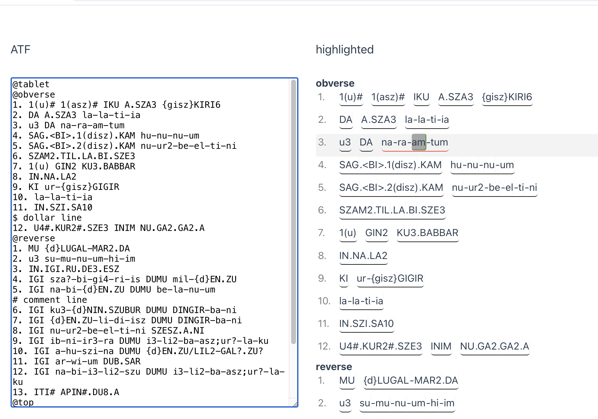

# atf-cuniform-utilities

This contains TypeScript functions which help when working with [ATF](http://oracc.museum.upenn.edu/doc/help/editinginatf/), a semi-standardized text markup format used by the [Cuneiform Digital Library Initiative](https://cdli.ucla.edu) as a way to transcribe the contents of [cuniform](https://en.wikipedia.org/wiki/Cuneiform) tablets.

More specifically it contains a tokenizer to split ATF contents into separate characters. See [here](https://gitlab.com/fcgl/annotator-showcase/-/blame/main/js/annotatorfunctions.js?page=2#L1098) and [here](https://github.com/ElectronicBabylonianLiterature/ebl-frontend/tree/4644dee9118484aa675cd37c3b6230e015760d86/src/transliteration/domain) for similar projects.



## Recommended IDE Setup

[VSCode](https://code.visualstudio.com/) + [Volar](https://marketplace.visualstudio.com/items?itemName=Vue.volar) (and disable Vetur).

## Type Support for `.vue` Imports in TS

TypeScript cannot handle type information for `.vue` imports by default, so we replace the `tsc` CLI with `vue-tsc` for type checking. In editors, we need [Volar](https://marketplace.visualstudio.com/items?itemName=Vue.volar) to make the TypeScript language service aware of `.vue` types.

## Customize configuration

See [Vite Configuration Reference](https://vitejs.dev/config/).

## Project Setup

```sh
npm install
```

### Compile and Hot-Reload for Development

```sh
npm run dev
```

### Type-Check, Compile and Minify for Production

```sh
npm run build
```

### Run Unit Tests with [Vitest](https://vitest.dev/)

```sh
npm run test:unit
```

## Questions

If a line is given but not all signs on the line are annotated, which is then the index of the signs: are there gaps possible. E.g. sign 1 2 4 5 are annotated 3 not.


`/` = we don't know which of the following signs to read, but it should be one of these. Indexing? Is this a single index or more than one index? Three signs with the same index? 


## Examples of special ATF instances 

1.	 example of character divider: `na-bi-{d}EN.ZU`, the combination of -{ is only one character divider.
2.	example of compound verbs: `PA3(|IGI.RU|)` or `E3(|UD.DU|)` - note the pipes within parentheses. We have to annotate both because the annotations need a goal and we still need to refer to the correct reading of a sign.
3.	example of missing or too many signs: we use `<x>` to indicate sign(s) we think is/are missing or `<<x>>` to indicate sign(s) that we think is/are wrongly put in, the missing signs will not be annotated but they still typically have an index, whereas the ones that are wrongly there will be annotated and also still have an index.
4.	example of word mixing: the rule is that hyphens split syllables or words within Proper nouns, whereas dots split different signs part of a word in logographic writing. Syllables are written with lower case letters, logograms with upper case letters. One typical confusion is that in Proper nouns two words written with logographic writing can be split by hyphens if they each refer to two individual words, e.g. `{d}EN.ZU` for the god Sîn, but `{d}EN.ZU-ZI` for the personal name Sîn-napišti (`ZI` = `napišti`).
5.	example of ambiguity for upper case: most upper case written signs are logograms, but some are uncertain readings for a sign, i.e. we can see what sign it is, but we don’t know how to understand it.


## Important ATF flags

* `#` = partial breakage, all signs after each other that are followed by a # will be parsed in classical publications to start and end with upper-half square brackets, e.g. ITI NE#.NE#.GAR# U4.5(disz).KAM parses to ITI ⸢NE.NE.GAR⸣ U4.5(disz).KAM. Most often these signs will also be annotated but sometimes they won't, depends on how bad the breakage is.
* `!` = corrected reading, is often followed by a parentheses with the original wrong reading, e.g. na!(u4), the value we read is 'na' but on the tablet we see 'u4'.
* `?` = uncertain identification of a sign
* `[]` = complete broken of section, can contain signs, e.g. [IGI {d}]EN.ZU-ZI DUB.SAR, the signs within square brackets are never annotated. Can also just be [...] to indicate that the break contains things we can't estimate, sometimes they also contain a number of x's indicating a number of signs we assume to be there, e.g. [IGI x-x-x-x] DUB.SAR.
* `<>` = signs that should be added, see above
* `<<>>` = signs that should be removed, see above
* `/` = we don't know which of the following signs to read, but it should be one of these.


## Credits

Development by [GhentCDH - Ghent University](https://www.ghentcdh.ugent.be/).

Funded by the [GhentCDH research projects](https://www.ghentcdh.ugent.be/projects).